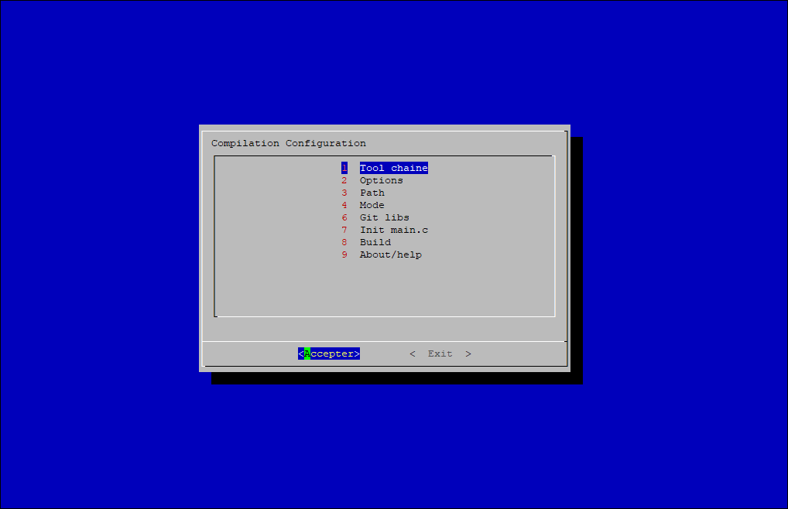

# Configure

## Purpose

This script will permit to generate and configure makefile easily, with dialog box or config file, for C or C++ projects.

## Usage
### Init:
Create makefile and config's folder:
```shell
./Configure/configure
```
This will display nothing, only create files and folders.

Call dialog box to configure makefile:
```shell
./Configure/configure
```
This cmd will display somes GUI:

```SHell
.
├── Tool chaine
│   ├── lib
│   │   ├── [ ] pthread
│   │   ├── [ ] sdl.1
│   │   ├── [ ] sdl.2
│   │   ├── [ ] realtime
│   │   ├── [ ] math
│   │   ├── [ ] ssl
│   │   ├── [ ] cares
│   │   ├── [ ] crypto
│   │   ├── [ ] use_DLL
│   │   └── [ ] create_DLL
│   ├── flags
│   │   └── FLAGS=
│   ├── Natives tools
│   │   ├── CC
│   │   └── CXX
│   ├── Additionnal natives libs
│   │   └── LIB=
│   ├── Cross tools
│   │   ├── LABEL
│   │   ├── CC
│   │   └── CXX
│   └── Additionnal cross tools
│   │   └── CROSS_LIB=
├── Options
│   ├── Hardware arch : xxx
│   │   ├── [ ] native compilation
│   │   └── [ ] cross compilation for arm
│   ├── Warnning : xxx
│   │   ├── [ ] standard
│   │   ├── [ ] no warning
│   │   └── [ ] all warnings
│   ├── Optimisation : xxx
│   │   ├── [ ] none
│   │   ├── [ ] minimal
│   │   ├── [ ] binary_size
│   │   └── [ ] execution_speed
│   ├── Linkage : xxx
│   │   ├── [ ] dynamic
│   │   └── [ ] static
│   ├── Debug
│   │   ├── [ ] GDB
│   │   ├── [ ] GPROF
│   │   └── [ ] FULL_CPP
│   └── Out : xxx
│       ├── [ ] binary
│       └── [ ] shared_lib
├── Path
│   ├── EXEC=
│   ├── OUTFOLDER=
│   ├── ROOT_DIR=
│   ├── DOC_DIR=
│   ├── SOURCE_DIR=
│   ├── PATCH_DIR=
│   ├── RESSOURCES_DIR=
│   ├── CONFIG_DIR=
│   └── LIB_DIR=
├── Mode
│   ├── [ ] compiled_with_debug_logs
│   └── [ ] compiled_without_debug_log
├── Patch
│   └── [ ] not working
├── Git
│   └── *see note
└── Compiler
```
##### \*Note:
The git option will request a github name and a clone root directory. Once it's done, the script will use curl to request to github the repo's name.

If git init was done, then new repos cloned will be add as git's submodules.

### Compile projet:
```shell
make
```

### Remove all temporary files:
Remove \*.o and \*.so filles
```shell
make clean
```

### Clean harder:
Remove all *\*.o*, *\*.so*, *exec* and files in *bin/out* and *doc* directory
```shell
make mrproper
```

### Clean full project:
Remove all files generated automaticly (I use it before create tar).

keep folders:
  - .
  - ..
  - .config/\*
  - .git/\*
  - Configure/\*
  - lib/\*
  - patch/\*
  - res/\*
  - src/\*

keep files:
- configure
```shell
make empty
```

### Advanced
the makefile config can be overwrite manually to change the output with this values:

| var label | default value | available values 	|
| ---		| ---			| ---				|
| GDB 		| off 			| on 				|
| GPROF 	| off 			| on 				|
| FULL_CPP 	| off 			| on 				|
| pthread 	| off 			| on 				|
| sdl.1 	| off 			| on 				|
| sdl.2		| off 			| on 				|
| realTime 	| off 			| on 				|
| path 		| off 			| on 				|
| ssl 		| off 			| on 				|
| cares 	| off 			| on 				|
| crypto 	| off 			| on 				|
| use_DLL 	| off 			| on 				|
| create_DLL | off 			| on 				|
| LINKAGE	| dynamique 	| static			|
| OPTIMISATION | -O0 		| -O1/-O2/-O3 		|
| OUT_DLL 	| static 		| dynamic			|
| WARNING 	| std 			| non/all			|
| EXEC 		| exec			| name of exec	|
| OUTFOLDER | out			| name of folder used for exec outputs |
| ROOT_DIR 	| bin			| name of root folder for exec binary |
| DOC_DIR 	| doc			| name of documentation |
| SOURCE_DIR | src 			| name of sources	|
| RESSOURCES_DIR | res 		| name of ressources[if needed] |
| LIB_DIR 	| lib 			| name of additionals libs |
| CONFIG_DIR | .config 		| name of config folder |
| CC 		| gcc			| C compiler [natif] |
| CXX 		| g++			| C++ compiler [natif] |
| LABEL 	| arm			| label for cross tool |
| HARD_ARCH | natif			| LABEL[use for next compilation] |
| CROSS_CC 	| arm-linux-gnueabi-gcc | C compiler [cross] |
| CROSS_CXX | arm-linux-gnueabi-g++ | C++ compiler [cross] |
| LIB 		|  				 | path of additionals libs |

for example this command will generate a cross compiled binary for arm with gdb activated.
```shell
make HARD_ARCH=arm GDB=on
```


### Tree examples:
After *git clone*:
```shell
.
├── Configure
│   ├── configure
│   ├── LICENSE
│   └── readme.md
├── res
│   └── LICENSE
└── src
    ├── lib
    │   ├── function.c
    │   └── function.h
    └── main.c
```

After *make*:
```shell
.
├── bin
│   ├── out
│   └── exec
├── Configure
│   ├── configure
│   ├── LICENSE
│   └── readme.md
├── makefile
├── makefile.bak
├── res
│   └── LICENSE
└── src
    ├── lib
    │   ├── function.c
    │   ├── function.h
    │   └── function.o
    ├── main.c
    └── main.o
```

After *make empty*:
```shell
.
├── Configure
│   ├── configure
│   ├── LICENSE
│   └── readme.md
├── res
│   └── LICENSE
└── src
    ├── lib
    │   ├── function.c
    │   └── function.h
    └── main.c
```

## Note:
### Date of compilation:
To add the date of compilation to your binary file in your sources code add :

```C
...
printf ( "date %s\n", DATE_BUILD );
...
```
